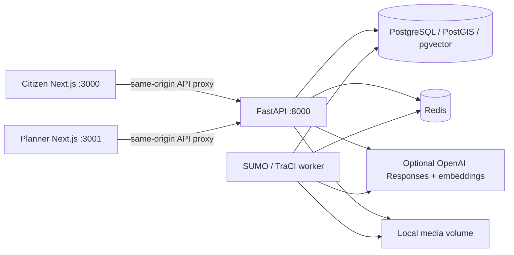

# Architecture

The browser holds its token in memory, so a page reload requires login. Next.js proxies API requests to the Compose service network. PostgreSQL and Redis are not published to host ports; UI/API ports bind to host loopback. Demo users are seeded idempotently and planner permissions are checked from stored account data, not caller-provided role fields.

PostGIS matches the confirmed WGS84 point using ST_Covers (including polygon boundaries). A GiST index supports ward geometry. Official ward geometry is not bundled. For local tests only, SQLite and Shapely implement equivalent application behavior; those tests do not prove extension behavior.

Knowledge documents are always available for deterministic lexical retrieval (token overlap, stable ID tie break). With credentials and PostgreSQL, missing document embeddings are generated and stored in vector(1536), with a model tag; pgvector cosine distance retrieves matching documents. Failures roll back the embedding transaction and fall back to lexical retrieval. The explanation is separated from immutable server-filtered candidate fields.

Candidate evaluation uses illustrative cost, duration, required right of way, construction, closure and bus impact attributes. Structured constraints are filtered before generation. Recognized monetary units and duration phrases tighten explicit form limits. General free-text promises are not a feasibility engine.

Jobs are persisted before processing. A single worker claims queued jobs with PostgreSQL row locking, reports heartbeat to Redis, and marks interrupted jobs failed after a restart. Redis ward publications supplement durable records; UI refresh is ten-second polling. A lost publication does not lose the complaint. This deployment uses one worker; scaling requires leases/recovery ownership instead of the current single-worker restart policy.

SUMO creates an uncalibrated four-arm signalized junction with netconvert. Baseline green is 40 seconds; the trial is user-controlled. Both runs have identical routes, demand, seed and horizon. Vehicle speeds, halting counts, completed/remaining vehicles and CO2 are read from TraCI; no fixed improvement factor is applied. No synthetic animation is labeled SUMO output.

Media files use generated filenames and signature checks. Images are decoded for validation. Files are served only through authenticated complaint access. Optional MP4 processing uses subprocess argument arrays and bounded duration/size. Anonymous public media URLs are not exposed.

Tables are created idempotently at startup for this initial version. There is no schema migration history yet; introducing schema changes against an existing deployment requires explicit migrations. Account provisioning, secret rotation, rate limiting, backups, data retention, HTTPS and identity-provider integration need a production deployment design.
